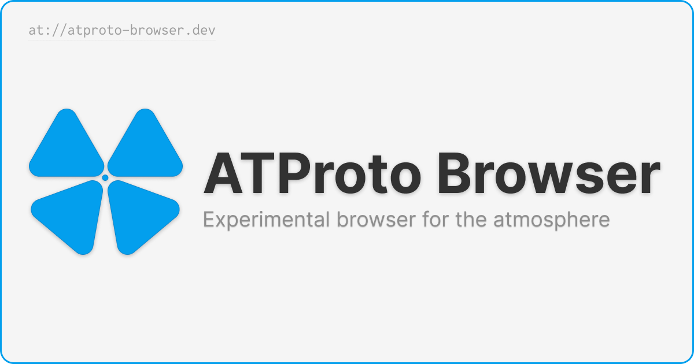

# ATProto Browser



[https://www.atproto-browser.dev](https://www.atproto-browser.dev)

ATProto Browser lets you browse files stored on the [ATProto](https://atproto.com) network.

Features:

- Browse files on any PDS using the owner's DID or Bluesky handle.
- A live feed of posts made on the Bluesky network with configurable sampling and buffer size.
- Consistent, predictable URLs that make it easy to share links.
- Rich previews for popular record types alongside raw JSON data.

ATProto Browser is a Next.js app built with React Server components. Server rendered wherever possible, with fallback to client side rendering for dynamic content.

Follow [@atproto-browser.dev](https://bsky.app/profile/atproto-browser.dev) on Bluesky for development updates!

## Getting Started

1. Clone the repository

```bash
git clone https://github.com/haroldadmin/atproto-browser.git
```

2. Install dependencies

```bash
yarn
```

3. Run the development server

```bash
yarn dev
```

## Contributing

This project is open for contributions. Feel free to open an issue or submit a PR if there's something you'd like to see!

## Disclaimer

This project is not affiliated with, or endorsed by Bluesky. I'm not a member of the Bluesky team, and this project is not an official product.
